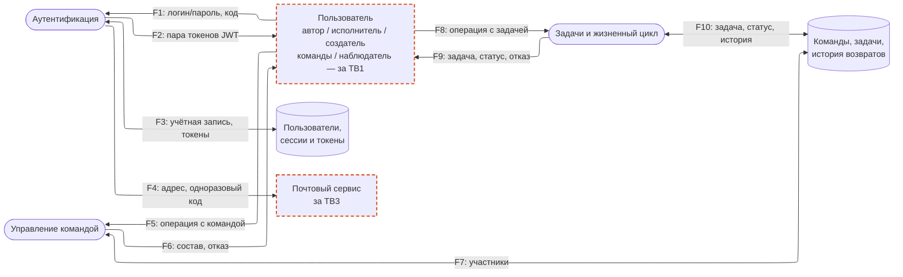

# Модель угроз

Модель продукта (архитектурный вид, границы доверия) и угрозы `T-*`, связанные с [требованиями безопасности](SECURITY_REQUIREMENTS.md) (`SR-*`). Проектные решения `D-*` появятся на S04.

## Модель продукта

| Поток | Откуда → куда | Данные | Граница |
| --- | --- | --- | --- |
| F1 | Пользователь → Аутентификация | логин/почта/пароль при регистрации или входе; код из письма | TB1 |
| F2 | Аутентификация → Пользователь | пара JWT-токенов (access + refresh) либо отказ | TB1 |
| F3 | Аутентификация ↔ Хранилище | учётная запись, хэш пароля; одноразовый код и refresh-токен с ограниченным сроком | — |
| F4 | Аутентификация → Почтовый сервис | адрес получателя, одноразовый код в открытом виде | TB3 |
| F5 | Пользователь → Управление командой | создание команды, добавление/удаление участника, токен доступа | TB1 |
| F6 | Управление командой → Пользователь | состав команды либо отказ | TB1 |
| F7 | Управление командой ↔ Хранилище | участники команды, создатель | — |
| F8 | Пользователь → Задачи и жизненный цикл | создание/правка задачи, смена статуса, приёмка/возврат, токен доступа | TB1 |
| F9 | Задачи и жизненный цикл → Пользователь | задача, новый статус либо отказ | TB1 |
| F10 | Задачи и жизненный цикл ↔ Хранилище | задача, статус, автор, исполнитель, история возвратов | — |

## Границы доверия

| Граница | Что пересекает | Почему требуется проверка |
| --- | --- | --- |
| TB1. Клиент ↔ сервер | Любой запрос: данные команды/задачи, заявленные роли и идентификаторы | Клиент не источник истины; скрытый элемент интерфейса или проверка в браузере не делает запрос допустимым |
| TB2. Участник ↔ действие с повышенными полномочиями | Операции, доступные по правилам продукта не всем участникам: смена статуса исполнителем, приёмка автором, состав команды создателем | Валидный токен подтверждает личность, но не каждое действие этой личности; роль для конкретной операции сервер проверяет отдельно (внутри «Управление командой» и «Задачи и жизненный цикл») |
| TB3. Сервер ↔ почтовый сервис | Адрес получателя и одноразовый код | Данные покидают контур продукта, дальнейший контроль над ними теряется |

## Значимые объекты и свойства

См. [PROJECT.md §5](../PROJECT.md#5-значимые-данные-и-другие-объекты): задача, учётные данные, состав команды, сессии и коды.

## Угрозы

| ID | Сценарий угрозы | Что нарушается | Граница / точка входа | Связанные SR | Приоритет | В наборе |
| --- | --- | --- | --- | --- | --- | --- |
| T-01 | Участник другой команды или не-участник запрашивает доску или карточку задачи по известному `teamId`/`taskId` | Конфиденциальность содержимого и факта существования задачи | TB1, проверка членства перед чтением отсутствует (F8/F9, F5/F6) | SR-01 | Высокий | да |
| T-02 | Участник команды при создании задачи указывает в запросе автором другого участника вместо себя | Целостность атрибуции действия | TB1, недоверенное поле тела запроса (F8) | SR-05 | Высокий | да |
| T-03 | Участник команды, не являющийся автором задачи, через запрос правки напрямую передаёт поля `executorId` или `status`, минуя проверку роли и серверную проверку перехода | Целостность состояния задачи | TB1, массовое присваивание полей (F8) | SR-04, SR-07 | Высокий | да |
| T-04 | Участник команды, не назначенный исполнителем, напрямую вызывает операцию смены статуса | Авторизация | TB2, роль не сверяется с исполнителем задачи | SR-02 | Высокий | да |
| T-05 | Исполнитель напрямую вызывает операцию приёмки или возврата и решает судьбу собственного результата | Авторизация | TB2, роль не сверяется с автором задачи | SR-03 | Высокий | да |
| T-06 | Автор или исполнитель напрямую вызывает операцию смены статуса с переходом, не предусмотренным жизненным циклом (например, «К выполнению» → «Готово» напрямую, выход из «Готово») | Целостность состояния | TB1, отсутствие серверной таблицы допустимых переходов | SR-07 | Высокий | да |
| T-07 | Автор дважды подряд (например, повторным кликом) запускает приёмку одной повторяющейся задачи двумя параллельными запросами и получает два следующих экземпляра; либо правки двух участников одной задачи приходят одновременно и теряют одно из изменений | Согласованность состояния | Внутренняя гонка операций в «Задачи и жизненный цикл» | SR-17 | Средний | да |
| T-08 | Участник команды, не являющийся её создателем, добавляет или удаляет участника | Авторизация | TB2, роль не сверяется с создателем команды | SR-06 | Средний | — |
| T-09 | Пользователь передаёт в параметре сортировки списка задач значение, не входящее в список разрешённых столбцов | Конфиденциальность и целостность данных в БД | TB1, запрос списка задач (F8) | SR-22 | Средний | — |
| T-10 | Тот, кто получает доступ к дампу таблицы пользователей, восстанавливает исходные пароли, если они хранятся нехэшированными или обратимо | Конфиденциальность учётных данных | Хранилище аутентификации (F3), вне обычного потока запросов | SR-08 | Средний | — |

**Обоснование приоритета.** Высокий — последствие прямо задевает основной сценарий продукта (доступ к чужим данным, действие от чужого имени, подмена роли) и достижимо без особых условий. Средний (T-07) — то же последствие, но требует точного совпадения по времени. Средний (T-08) — тот же паттерн ролевой проверки, что в T-04/T-05/T-06, отдельного инженерного решения не добавляет. T-09 и T-10 — общая инженерная гигиена (не специфична для Vedu), но закрывает требования SR-22 и SR-08, которые иначе остались бы без модели; в приоритетный набор не входят.

## Приоритетный набор

Отмечен выше колонкой «В наборе»: T-01…T-07, три кластера — один приём на кластер, ожидается 3 решения `D-*` на S04.

1. **Изоляция команд** — T-01 → SR-01. Проверка членства перед каждым чтением ресурса команды.
2. **Идентичность действующего пользователя** — T-02, T-03 → SR-04, SR-05, SR-07. Пользователь определяется только из токена; разрешённый список полей на запись.
3. **Переходы жизненного цикла** — T-04, T-05, T-06, T-07 → SR-02, SR-03, SR-07, SR-17. Серверная таблица допустимых переходов + сверка роли с пользователем из токена в одной операции.
