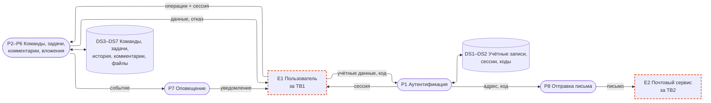
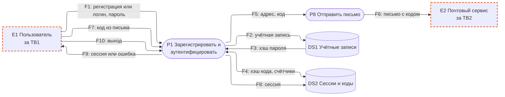
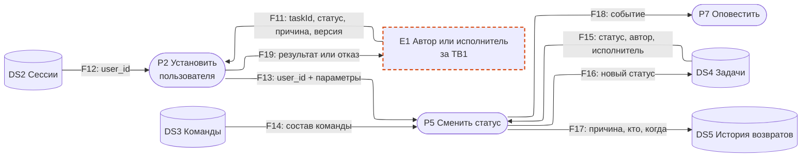
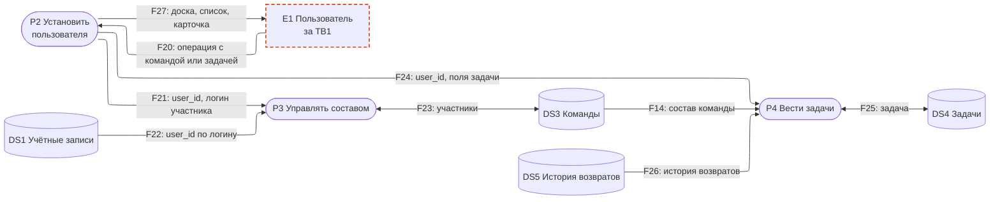
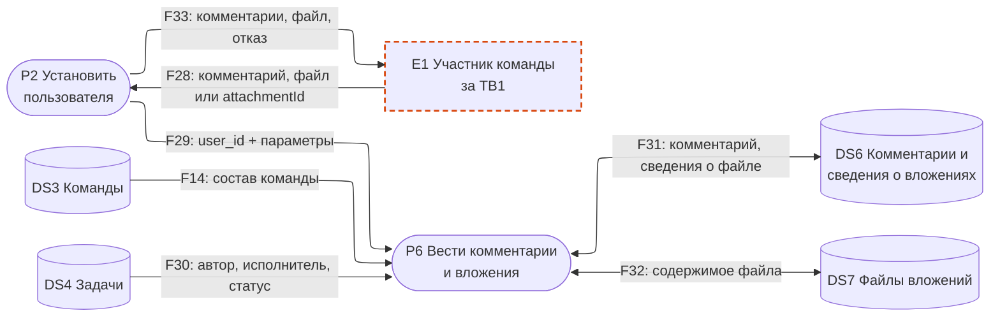
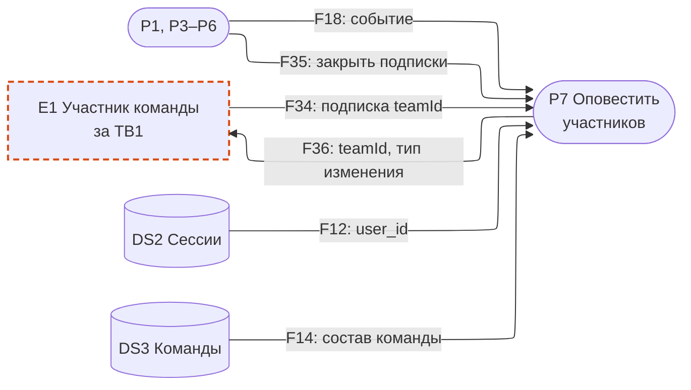
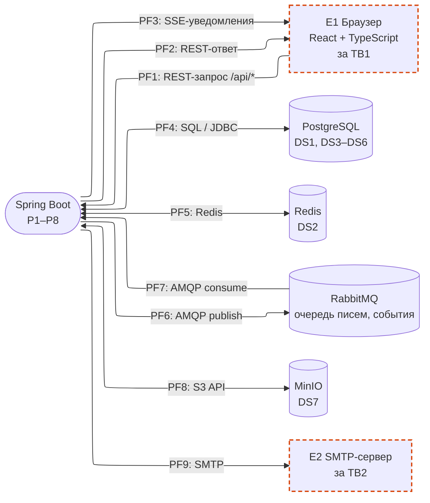

# DFD — Vedu

- [Логическая DFD](#логическая-dfd) — бизнес-действия и данные без технологий: обзор и фрагменты A–E по сценариям.
- [Физическая DFD](#физическая-dfd) — те же потоки в реализации: компоненты, протоколы, хранилища.

Границы доверия: **TB1** — браузер ↔ сервер, **TB2** — сервер ↔ почтовый сервис, **TB3** — сервер ↔ хранилища. Оранжевая пунктирная рамка — внешняя сущность за TB1 или TB2; все хранилища находятся за TB3.

## Логическая DFD

### Обзор

Поток, уже описанный в другом фрагменте, повторяется на схеме с тем же номером и в таблице фрагмента не дублируется.

### A. Аутентификация

UC-01…UC-03.

| Поток | Откуда → куда | Данные | Граница |
| --- | --- | --- | --- |
| F1 | E1 → P1 | регистрация: логин, почта, имя, пароль; вход: логин, пароль | TB1 |
| F2 | P1 → DS1 | логин, почта, имя, хэш пароля, признак «не подтверждена» | TB3 |
| F3 | DS1 → P1 | хэш пароля, признак подтверждения почты | TB3 |
| F4 | P1 ↔ DS2 | хэш кода, назначение, срок, остаток попыток; счётчики неудачных входов и запросов кода по логину и IP | TB3 |
| F5 | P1 → P8 | адрес почты, код в открытом виде, назначение | — |
| F6 | P8 → E2 | письмо с кодом | TB2 |
| F7 | E1 → P1 | идентификатор попытки, код из письма | TB1 |
| F8 | P1 → DS2 | новая сессия: идентификатор, user_id, срок; аннулирование кода; удаление сессии при выходе | TB3 |
| F9 | P1 → E1 | идентификатор сессии либо единое сообщение «неверный логин или пароль» | TB1 |
| F10 | E1 → P1 | запрос выхода, идентификатор сессии | TB1 |

### B. Смена статуса задачи

UC-12…UC-15, UC-19. Перенос карточки и кнопка в карточке — одна операция.

| Поток | Откуда → куда | Данные | Граница |
| --- | --- | --- | --- |
| F11 | E1 → P2 | taskId, целевой статус, причина возврата, ожидаемая версия задачи, идентификатор сессии | TB1 |
| F12 | DS2 → P2 | user_id и срок сессии; используется в каждом запросе после входа | TB3 |
| F13 | P2 → P5 | user_id из сессии, taskId, целевой статус, причина, версия | — |
| F14 | DS3 → P5 | участники команды задачи; тот же поток читают P4, P6, P7 | TB3 |
| F15 | DS4 → P5 | текущий статус, автор, исполнитель, версия, настройка повторения | TB3 |
| F16 | P5 → DS4 | новый статус и версия — только при совпадении версии; при приёмке повторяющейся задачи — следующий экземпляр в той же транзакции | TB3 |
| F17 | P5 → DS5 | причина возврата, user_id вернувшего, серверное время — в одной транзакции с `F16` | TB3 |
| F18 | P3, P4, P5, P6 → P7 | teamId, тип изменения | — |
| F19 | P2 → E1 | новый статус либо отказ с актуальным состоянием задачи | TB1 |

### C. Команды и задачи

UC-04…UC-11, UC-16…UC-18, UC-20…UC-22.

| Поток | Откуда → куда | Данные | Граница |
| --- | --- | --- | --- |
| F20 | E1 → P2 | операция с командой или задачей, её параметры, идентификатор сессии | TB1 |
| F21 | P2 → P3 | user_id из сессии; название новой команды либо teamId и логин добавляемого или удаляемого участника | — |
| F22 | DS1 → P3 | user_id по логину, признак подтверждения почты | TB3 |
| F23 | P3 ↔ DS3 | создатель и участники команды; добавление или удаление участника | TB3 |
| F24 | P2 → P4 | user_id из сессии; teamId, название, описание, исполнитель, приоритет, срок, подзадачи, повторение; для правки — taskId и версия; столбец сортировки списка | — |
| F25 | P4 ↔ DS4 | запись задачи с автором из сессии; чтение задач команды | TB3 |
| F26 | DS5 → P4 | история возвратов для карточки | TB3 |
| F27 | P2 → E1 | задачи команды, логины и имена участников, история возвратов, доступные действия либо отказ | TB1 |

### D. Комментарии и вложения

UC-24…UC-28.

| Поток | Откуда → куда | Данные | Граница |
| --- | --- | --- | --- |
| F28 | E1 → P2 | taskId, текст комментария, упомянутые логины; либо файл, исходное имя, заявленный тип; либо commentId или attachmentId; идентификатор сессии | TB1 |
| F29 | P2 → P6 | user_id из сессии и параметры операции | — |
| F30 | DS4 → P6 | автор, исполнитель и статус задачи | TB3 |
| F31 | P6 ↔ DS6 | комментарий с автором из сессии и временем; сведения о вложении: id, исходное имя, проверенный тип, размер, загрузивший | TB3 |
| F32 | P6 ↔ DS7 | содержимое файла под идентификатором, сгенерированным сервером | TB3 |
| F33 | P2 → E1 | комментарии задачи, файл с заголовками типа и имени либо отказ | TB1 |

### E. Оповещение

UC-23.

| Поток | Откуда → куда | Данные | Граница |
| --- | --- | --- | --- |
| F34 | E1 → P7 | подписка на обновления: teamId, идентификатор сессии | TB1 |
| F35 | P1, P3 → P7 | user_id, чьи подписки закрыть: выход или удаление из команды | — |
| F36 | P7 → E1 | teamId и тип изменения, без данных задачи; данные клиент получает через `F27` с полной проверкой прав | TB1 |

## Физическая DFD

| Поток | Откуда → куда | Протокол и данные | Логические потоки | Граница |
| --- | --- | --- | --- | --- |
| PF1 | Браузер → Spring Boot | HTTP, TLS не настроен; JSON или multipart с файлом; cookie с идентификатором сессии | F1, F7, F10, F11, F20, F28, F34 | TB1 |
| PF2 | Spring Boot → браузер | JSON или байты файла с заголовками типа и имени; `Set-Cookie` с идентификатором сессии | F9, F19, F27, F33 | TB1 |
| PF3 | Spring Boot → браузер | SSE (`text/event-stream`) по открытому запросу подписки: teamId, тип изменения | F36 | TB1 |
| PF4 | Spring Boot ↔ PostgreSQL | SQL по JDBC; смена статуса и запись возврата — одна транзакция | F2, F3, F14–F17, F22–F26, F30, F31 | TB3 |
| PF5 | Spring Boot ↔ Redis | сессии, хэши кодов, счётчики попыток — ключи с TTL | F4, F8, F12 | TB3 |
| PF6 | Spring Boot → RabbitMQ | очередь писем: адрес, код, назначение; обмен событий: teamId, тип изменения, user_id для закрытия подписок | F5, F18, F35 | TB3 |
| PF7 | RabbitMQ → Spring Boot | те же сообщения: обработчику писем (P8) и SSE-подпискам (P7) | F5, F18, F35 | TB3 |
| PF8 | Spring Boot ↔ MinIO | запись и чтение объекта по ключу, сгенерированному сервером, в приватном бакете | F32 | TB3 |
| PF9 | Spring Boot → SMTP-сервер | письмо с кодом | F6 | TB2 |

### Эндпоинты

Все эндпоинты, кроме регистрации и входа, требуют cookie сессии.

| Эндпоинт | Use case | Процесс | Логические потоки |
| --- | --- | --- | --- |
| `POST /api/auth/register` | UC-01 | P1 | F1 |
| `POST /api/auth/login` | UC-02 | P1 | F1 |
| `POST /api/auth/confirm` | UC-01, UC-02 | P1 | F7, F9 |
| `POST /api/auth/code/resend` | UC-01, UC-02 | P1 | F5 |
| `POST /api/auth/logout` | UC-03 | P1 | F10, F35 |
| `GET /api/teams` | UC-05 | P3 | F20, F27 |
| `POST /api/teams` | UC-04 | P3 | F20, F21 |
| `POST /api/teams/{teamId}/members` | UC-06 | P3 | F20, F21 |
| `DELETE /api/teams/{teamId}/members/{login}` | UC-07 | P3 | F20, F21, F35 |
| `GET /api/teams/{teamId}/tasks?sort=` | UC-20, UC-21 | P4 | F20, F27 |
| `POST /api/teams/{teamId}/tasks` | UC-08 | P4 | F20, F24 |
| `GET /api/tasks/{taskId}` | UC-09 | P4 | F20, F27 |
| `PATCH /api/tasks/{taskId}` | UC-10, UC-16, UC-18 | P4 | F20, F24 |
| `DELETE /api/tasks/{taskId}` | UC-11 | P4 | F20, F24 |
| `PATCH /api/tasks/{taskId}/subtasks/{subtaskId}` | UC-17 | P4 | F20, F24 |
| `POST /api/tasks/{taskId}/transitions` | UC-12…UC-15 | P5 | F11, F19 |
| `POST /api/tasks/{taskId}/comments` | UC-24 | P6 | F28, F33 |
| `DELETE /api/comments/{commentId}` | UC-25 | P6 | F28 |
| `POST /api/tasks/{taskId}/attachments` | UC-26 | P6 | F28 |
| `GET /api/attachments/{attachmentId}` | UC-27 | P6 | F28, F33 |
| `DELETE /api/attachments/{attachmentId}` | UC-28 | P6 | F28 |
| `GET /api/teams/{teamId}/events` | UC-23 | P7 | F34, F36 |
